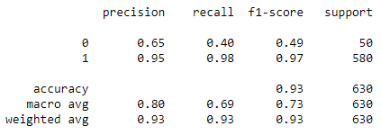

# Classificação de clientes se estão satisfeitos ou não satisfeitos
Este repositório contém script para classificar reviews positivos ou negativos de um conjunto de dados

 

# _Objetivo do projeto_

Desenvolver um classificador de sentimentos que vai indicar se um determinado texto é positivo ou negativo.

 

# _1. Problema de Negócio_

Este estudo é importante pelo fato de que praticamente todas as empresas possuem dados em redes sociais e este tipo de técnica também pode ser utilizado em textos que são postados em redes sociais e submeter o classificador para verificar se as pessoas estão falando bem ou se estão falando mal de um determinado produto.

O departamento de relações públicas precisa acompanhar e análisar os reviews das pessoas, quando publicadas nas redes sociais.

Fonte: https://www.kaggle.com/sid321axn/amazon-alexa-reviews/kernels

 

# _2. Justificativa_

- **Por quê:** Dificuldade em classificação se são reviews positivos ou negativos.
- **Como:** Com a método CRISP-DM.
- **O quê:** Usando o método Count vectorization (tokenização) que é a ideia de transformar as letras em números para que depois possamos passar para o nosso algoritmo de aprendizagem de máquina.

 

# _3. Premissas_

O conjunto de dados de amostra resume o comportamento de 3.150 clientes da Amazon.

As variáveis originais do conjuto de dados são: 

Variável | Definição
------------ | -------------
rating | nota que a pessoa deu ao produto|
date | data de quando o review foi postado no site|
variation | variação do produto, que pode indicar as cores|
verified_reviews | texto que o usuário escreveu sobre o produto|
feedback | 1 que é um texto positivo e 0 que é um texto negativo|

 

# _4. Planejamento da Solução_

1. Entendimento do negócio:
    - Foi realizado a descrição do negócio.
2. Coleta dos dados:
    - Foi feito o downloand do arquivo da plataforma do Kangle.
3. Limpeza dos dados:
    - Foi realizado a Análise Descritiva dos Dados, passo importante para verificar o quanto, o projeto é desafiador, ou seja verificar a qualidade dos dados e o entendimento dos dados.
4. Análise exploratória dos dados:
    - Nesta etapa foi realizado a Exploração de Dados, que serve para medir o impacto das variáveis em relação as variáveis respostas e muitas vezes quantificar este impacto, nesta etapa começa gerar valor para o entendimento do negócio.
5. Preparação dos dados:
    - Agora entramos na Modelagem dos dados, onde vamos preparar os dados para ensinar os Algoritmo de Machine learning, passo importante, porque o aprendizado da maioria dos algoritmos de ML é facilitado com dados numéricos e na mesma escala.
6. Treinamento algoritmos de machine learning:
    - Nesta etapa vamos implementar os Algoritmos de Machine Learning, e escolher o que tem mais performance e seguir com ele para a produção.
7. Implementar o modelo para produção:
   - É a etapa em colocar em produção ou fazer uma simulação do modelo, para deixar acessível para qualquer consumidor.

 

# _5. Insights_

*Resumo dos insights durante análise exploratória de dados (EDA):*

**Gráfico para visualizar a distribuição dos caracteres de cada um dos reviews.**

 

**Nota:**
- Podemos observar que a maioria dos textos tem entre 0, 100 e 200 caracteres e temos alguns outros reviews mais para direita com quase 2 mil caracteres.
- Quando os reviews são negativos as pessoas escrevem em média 215 caracteres e quando é positivo elas escrevem 124 caracteres.

**Gráfico para encontrar algum tipo de relação entre a variação do produto e a nota da pessoa.**

 

**Nota:**
- Temos 16 categorias para classificar o produto.
- Podemos obervar que o produto que tem o menor rating tem a cor branca (white), talves as pessoas acabem não gostando tanto assim da cor branca e preferem outro tipo de cor e pode ser um indicativo de que essa cor não seja tão interessante para este produto.

**Gráfico da nuvem das palavras negativas.**

 

**Nota:**
- A palavra mais falada é **'device'**, que provavelmente estão reclamando do **'dispositivo'**.

 

# _6. Modelos de Machine Learning_

1. Naive Bayes.
2. Regressão Logística.

 

# _7. Performance do Modelo de Machine Learning_

Analisando este estudo de caso é **mais interessante capturar os reviews negativos**, então o modelo Naive Bayes tem um melhor desempenho, embora que a diferença seja pouca, com um f1-score de 73%.

 

- Classe 0 = texto negativo
- Classe 1 = texto positivo

Quando temos dados desbalanceado é interessante nós utilizarmos f1-score junto com macro avg, onde temos um valor de 0.73, que não é um resultado muito bom.

Na classe 0 temos um recall de 40%, que indica que o modelo identifica corretamente 40% dos reviews negativos e quando o modelo identifica um reviews negativo ele está correto em 65% dos casos.

Na classe 1 temos um recall de 98%, que indica que o modelo identifica corretamente 98% dos reviews positivos e quando o modelo identifica um reviews positivo ele está correto em 95% dos casos.

Matriz de confusão

 

- Na classe 0 (texto negativo):
 - O algoritmo classificou corretamente 20 textos como negativos e 30 textos que algoritmo errou porque de fato são textos positivos.

- Na classe 1 (texto positivo):
 - O algoritmo classificou de forma errada 11 textos como negativos e 569 textos que algoritmo acertou porque de fato eles positivos.

 

# _8. Conclusão_

E o resultado desta solução, caso fosse implementada, seria proporcionar uma análise dos reviews das pessoas e classificar os textos entre positivos e negativos, desta forma a empresa pode tomar alguma atitude, entrando em contato com o cliente para ver o que exatamente aconteceu.

 

# _9. Próximos passos_

Fazer um balanceamento de dados, porque consequência desse desequilíbrio é que o modelo terá uma tendência a dar muitos “alarmes falsos“, ou seja, na prática ele irá responder muito bem entradas para as classes majoritárias, mas terá um desempenho inferior para as minoritárias e saber como lidar com dados desbalanceados pode fazer toda a diferença no projeto de Data Science e no desempenho do seu modelo de Machine Learning.
